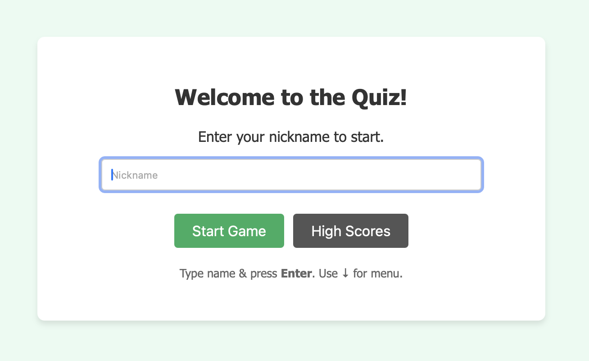
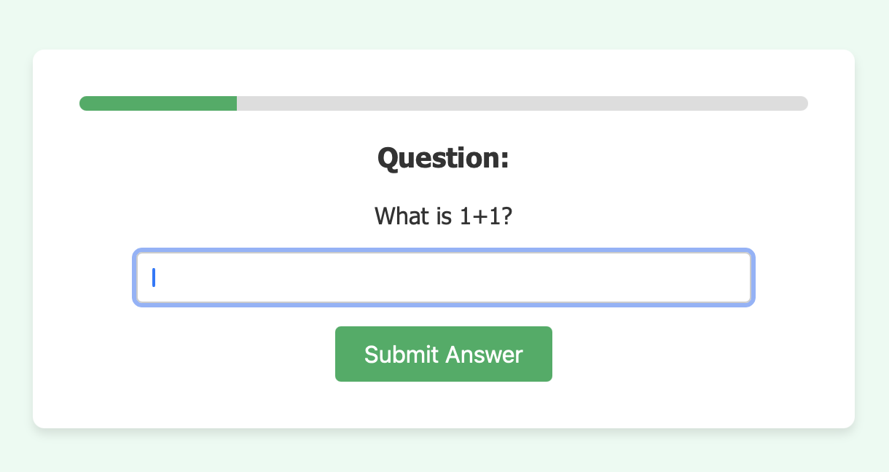
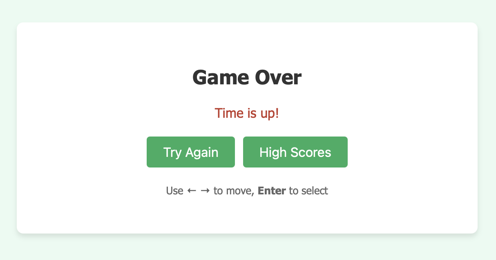
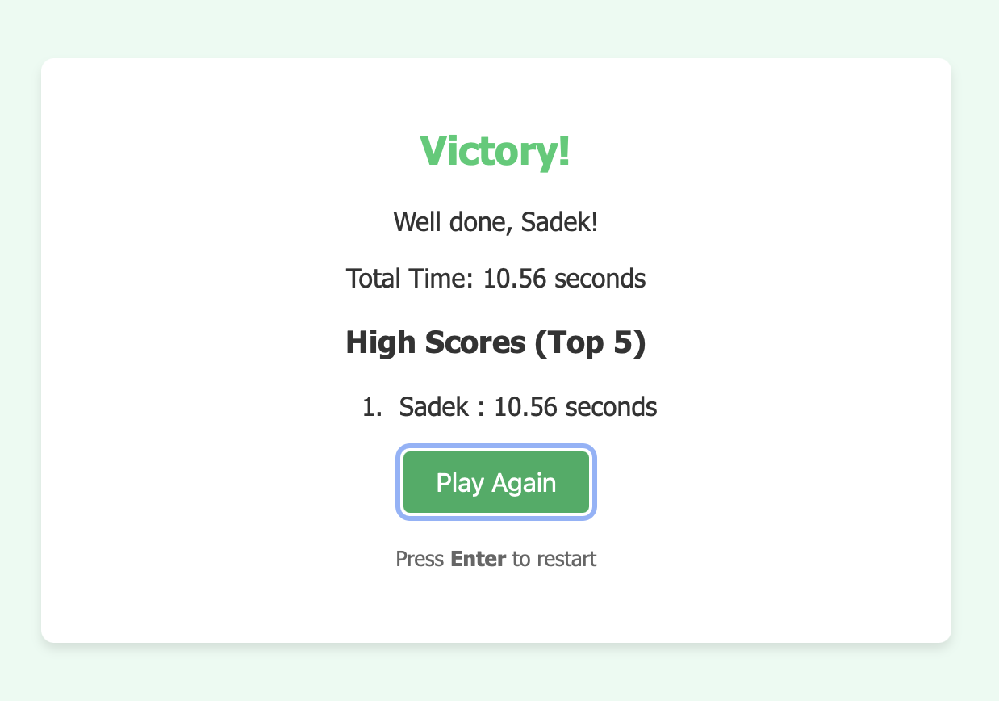
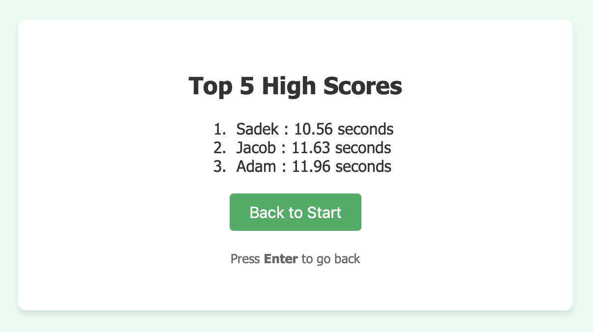

# The Quiz Application

## Description
This is a Single Page Application (SPA) quiz game built with Vanilla JavaScript. The application communicates asynchronously with a RESTful API to fetch questions and validate answers. It features a timed gameplay mechanic, keyboard navigation support, and a high-score system that persists using the browser's Web Storage.

The project is organized using a modern JavaScript builder (Vite) and adheres to strict code quality standards using ESLint and Stylelint.

## Getting Started

Follow these instructions to get a copy of the project up and running on your local machine.

### Prerequisites
* Node.js (v14 or higher recommended)
* npm (Node Package Manager)

### Installation

#### 1. Download or Clone the repository:
- Copy `git@gitlab.lnu.se:1dv528/student/sa225sd/a2-quiz.git` from this repo.
- Open terminal and navigate to the folder you want to put the repo in.
- Use `git clone` and paste the repo link.

#### 2. Install dependencies:
* Navigate into the project folder:
* Follow the [instructions](https://gitlab.lnu.se/1dv528/course-content/html-css-javascript-dev-tools)
 to setup your envoirnment 

### Running the Application
#### 1. Development Mode:
* To start the development server with live reloading: `npm run dev`
* To check the code quality using linters: `npm run lint`

#### 2. Production Mode (Build):
* Build the project for production: `npm run build`

* Start the local web server: `npm run http-server dist`

* The terminal will show a local address (e.g., `http://127.0.0.1:9001`). Click that link to play the game.

## How to Play
The goal is to answer as many questions correctly as possible within the time limit!

1. **Start:** Enter your nickname and press **Enter**.

2. **Timer:** You have **10 seconds** to answer each question.
3. **Controls:**
* **Text Questions:** Type your answer and press **Enter**.
* **Multiple Choice:** Use the **Arrow Keys** to select an option and press **Enter**.

4. **Game Over:** If you run out of time or answer incorrectly, the game ends.

5. **Victory:** Answer all questions correctly to see your total time. If you are fast enough, you will be saved to the High Score list!

**Note:** The entire game can be played using only the keyboard (no mouse required).

